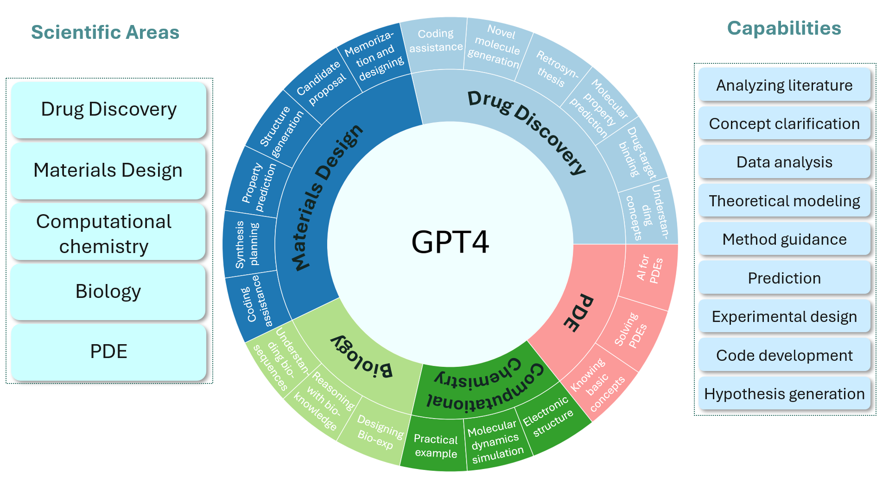

<h1 align="center">
The Impact of Large Language Models on Scientific Discovery:
  
A Preliminary Study using GPT-4
</h1>

<h3>Microsoft Research AI4Science, Microsoft Azure Quantum</h3>
  

# Introduction

  

Groundbreaking advancements in NLP have culminated in the emergence of powerful large language models (LLMs), which have showcased remarkable capabilities across a vast array of domains. In this report, we delve into the performance of **LLMs within the context of scientific discovery**, focusing on GPT-4. Our investigation spans a diverse range of scientific areas encompassing **drug discovery, biology, computational chemistry (density functional theory (DFT) and molecular dynamics (MD)), materials design, and partial differential equations (PDE)**. Evaluating GPT-4 on scientific tasks is crucial for uncovering its potential across various research domains, validating its domain-specific expertise, accelerating scientific progress, optimizing resource allocation, guiding future model development, and fostering interdisciplinary research. Our exploration methodology primarily consists of expert-driven case assessments, which offer qualitative insights into the model's comprehension of intricate scientific concepts and relationships, and occasionally benchmark testing, which quantitatively evaluates the model's capacity to solve well-defined domain-specific problems. Our preliminary exploration indicates that **GPT-4 exhibits promising potential for a variety of scientific applications, demonstrating its aptitude for handling complex problem-solving and knowledge integration tasks**. Broadly speaking, we evaluate GPT-4's knowledge base, scientific understanding, scientific numerical calculation abilities, and various scientific prediction capabilities.

# Observation and Summary
👍represents strength of the abilities, 😵 represents the abilities need to be improved. 

## Drug Discovery
* 👍***Broad Knowledge***: GPT-4 demonstrates a wide-ranging understanding of key concepts in drug discovery, including individual drugs, target proteins, general principles for small-molecule drugs, and the challenges faced in various stages of the drug discovery process. 
* 👍***Versatility in Key Tasks***: LLMs, such as GPT-4, can help in several essential tasks in drug discovery, including Molecule Manipulation, Drug-Target Binding Prediction, Molecule Property Prediction, Retrosynthesis Prediction and so on.
* 👍***Novel Molecule Generation***: GPT-4 can be used to generate novel molecules following text instruction. This de novo molecule generation capability can be a valuable tool for identifying new drug candidates with the potential to address unmet medical needs.
* 👍***Coding capability***: GPT-4 can provide help in coding for drug discovery, offering large benefits in data downloading, processing, and so on. The strong coding capability of GPT-4 can greatly ease human efforts in the future.
* 😵***SMILES Sequence Processing Challenges***: GPT-4 may struggle with directly processing SMILES sequences. To improve the model’s understanding and output, it is better to provide the names of drug molecules along with their descriptions, if possible.
* 😵***Limitations in Quantitative Tasks***: GPT-4 may face limitations when it comes to quantitative tasks, such as predicting numerical values for molecular properties and drug-target binding. Researchers are advised to take GPT-4’s output as a reference and perform verification using dedicated AI models or scientific computational tools to ensure reliable conclusions.
* 😵***Double-Check Generated Molecules***: When generating novel molecules with GPT-4, it is essential to verify the validity and chemical properties of the generated structures.

## Biology 
* 👍***Bioinformation Processing***: GPT-4 displays its understanding of information processing from specialized files in biological domains, such as MEME format, FASTQ format, and VCF format. Furthermore, it is adept at performing bioinformatic analysis with given tasks and data, exemplified by predicting the signaling peptides for a provided sequence.
* 👍***Biological Understanding***: GPT-4 demonstrates a broad understanding of various biological topics, encompassing consensus sequences, PPI, signaling pathways, and evolutionary concepts. 
* 👍***Biological Reasoning***: GPT-4 possesses the ability to reason about plausible mechanisms from biological observations using its built-in biological knowledge.
* 👍***Biological Assisting***: GPT-4 demonstrates its potential as a scientific assistant in the realm of protein design tasks, and in wet lab experiments by translating experimental protocols for automation purposes.
* 😵***FASTA Sequence Understanding***: A notable challenge for GPT-4 is the direct processing of FASTA sequences. It is preferable to supply the names of biomolecules in conjunction with their sequences when possible.
* 😵***Inconsistent Result***: GPT-4’s performance on tasks related to biological entities is influenced by the abundance of information pertaining to the entities. Analysis of under-studied entities, such as transcription factors, may yield inconsistent results.
* 😵***Arabic Number Understanding***: GPT-4 struggles to directly handle Arabic numerals; converting Arabic numerals to text is recommended.
* 😵***Quantitative Calculation***: While GPT-4 excels in biological language understanding and processing, it encounters limitations in quantitative tasks (Fig. 3.7). Manual verification or validation with alternative computational tools is advisable to obtain reliable conclusions.

## Computational Chemistry
* 👍***Literature Review***: GPT-4 possesses extensive knowledge of computational chemistry, covering topics such as density functional theory, Feynman diagrams, and fundamental concepts in electronic structure theory, molecular dynamics simulations, and molecular conformation generation. 
* 👍***Code Development***: GPT-4 is able to assist with the implementation of novel algorithms or functionality in existing computational chemistry and physics software packages.
* 👍***Method Selection***: GPT-4 is able to recommend suitable computational methods and software packages for specific research problems, taking into account factors such as system size, timescales, and level of theory.
* 👍***Simulation Setup***: GPT-4 is able to aid in preparing simple molecular-input structures, establishing and suggesting simulation parameters, including specific symmetry, density functional, time step, ensemble.
* 👍***Experimental, Computational, and Theoretical Guidance***: GPT-4 is able to assist researchers by providing experimental, computational, and theoretical guidance.
* 😵***Hallucinations***: GPT-4 may occasionally generate incorrect information. It may struggle with complex logic reasoning. Researchers need to independently verify and validate outputs and suggestions from GPT-4. 
* 😵***Raw Atomic Coordinates***: GPT-4 is not adept at generating or processing raw atomic coordinates of complex molecules or materials. However, with proper prompts that include molecular formula, name, or other supporting information, GPT-4 may still work for simple systems. 
* 😵***Precise Computation***: GPT-4 is not proficient in precise calculations in our evaluated benchmarks and usually ignores physical priors such as symmetry and equivariance/invariance. Currently, the quantitative numbers returned by GPT-4 may come from a literature search or few-shot examples. It is better to combine GPT-4 with specifically designed scientific computation packages or machine learning models, such as Graphormer and DiG.
* 😵***Hands-on Experience***: GPT-4 can only provide guidance and suggestions but cannot directly perform experiments or run simulations. Researchers will need to set up and execute simulations or experiments by themselves or leverage other frameworks based on GPT-4, such as AutoGPT , HuggingGPT, AutoGen and so on.

## Materials Design
* 👍***Information memorization***: Excels in memorizing information and suggesting design principles for inorganic crystals and polymers. Its understanding of basic rules for materials design in textual form is remarkable. For instance, when designing solid-state electrolyte materials, it can competently propose ways to increase ionic conductivity and provide accurate examples.
* 👍***Composition Creation***: Proficient in generating feasible chemical compositions for new inorganic materials.
* 👍***Synthesis Planning***: Exhibits satisfactory performance for synthesis planning of inorganic materials.
* 👍***Coding Assistance***: Provides generally helpful coding assistance for materials tasks. It can generate molecular dynamics and DFT inputs for numerous property calculations and can correctly utilize many computational packages and construct automatic processing pipelines. Iterative feedback and manual adjustments may be needed to fine-tune the generated code. 
* 😵***Representation***: Encounters challenges in representing and proposing organic polymers and MOFs. 
* 😵***Structure Generation***: Limited capability for structure generation, particularly when generating accurate atomic coordinates.
* 😵***Predictions***: Falls short in providing precise quantitative predictions in property prediction. For instance, when predicting whether a material is metallic or semi-conducting, its accuracy is only slightly better than a random guess.
* 😵***Synthesis Route***: Struggles to propose synthesis routes for organic polymeric materials not present in the training set without additional guidance.

## Partial Differential Equation
* 👍***PDE Concepts***: GPT-4 demonstrates its awareness of fundamental PDE concepts, thereby enabling researchers to gain a deeper understanding of the PDEs they are working with. It can serve as a helpful resource for teaching or mentoring students, enabling them to better understand and appreciate the importance of PDEs in their academic pursuits and research endeavors. 
* 👍***Concept Relationships***: The model is capable of discerning relationships between concepts, which may aid mathematicians in broadening their perspectives and intuitively grasping connections across different subfields. 
* 👍***Solution Recommendations***: GPT-4 can recommend appropriate analytical and numerical methods for addressing various types and complexities of PDEs. Depending on the specific problem, it can suggest suitable techniques for obtaining either exact or approximate solutions..
* 👍***Code Generation***: The model is capable of generating code in different programming languages, such as MATLAB and Python, for numerical solution of PDEs, thus facilitating the implementation of computational solutions.
* 😵***Output Verification***: While GPT-4 exhibits human-like capabilities in solving partial differential equations and providing explicit solutions, there might be instances of incorrect derivation. Researchers should exercise caution and verify the model’s output when using GPT-4 to solve PDEs. 
* 😵***Hallucinations Awareness***: GPT-4 may occasionally erroneously cite non-existent references. Researchers should cross-check citations and be aware of this limitation to ensure the accuracy and reliability of the information provided by the model. 

# Contribution Invitation

# Trademarks

This project may contain trademarks or logos for projects, products, or services. Authorized use of Microsoft 
trademarks or logos is subject to and must follow 
[Microsoft's Trademark & Brand Guidelines](https://www.microsoft.com/en-us/legal/intellectualproperty/trademarks/usage/general).
Use of Microsoft trademarks or logos in modified versions of this project must not cause confusion or imply Microsoft sponsorship.
Any use of third-party trademarks or logos are subject to those third-party's policies.
